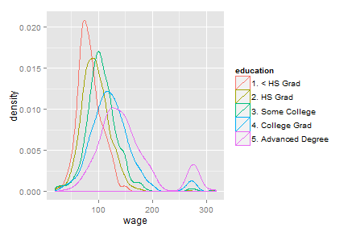

### <b>WHY</b> have a Plotting Predictors Application?

* Easily visualise predictors from the <b>Wage</b> data
* Understanding how the data looks & how it interacts at a glance
* Quick access to a selection of the most popular plotting methods
* Switch easily between plot types and compare results

---
### <b>WHAT</b> is the Plotting Predictors Application?
* A simple application that provides a number of the most popular predictor plots
* Works on the <b>Wage</b> dataset
* Offers a selection of 5 different plot types 
* The plot types available are:
  * <b>Feature Plot (Wage)</b>: Feature plot using age, education and jobcode against wage
  * <b>Jobclass (Age vs Wage)</b>: Plot of age vs wage coloured by jobclass.
  * <b>Smoothers (Age vs Wage)</b>: Plot of age vs wage coloured by education with linear smoother for each education class
  * <b>Boxplot (Wage vs Age)</b>: Boxplot of age vs wage showing with different colours the various wage ranges
  * <b>Density Plot (Wage)</b>: Density plot of wage vs education

---
### <b>HOW</b> does the Plotting Predictors Applications Work?

* The user selects the plot type from a drop-down list
* The code for the plot is generated
* The plot appears on the right hand side of the screen
* An example of the <b>Density Plot (Wage)</b> is shown below:

 

---
<blockquote>

    
The Plotting Predictor Application Rocks!

 

 </nl></nl></nl>It Speeds Up Your Analysis and Gets you to Your Results   

 <b>FAST!!!</b>

</blockquote>
